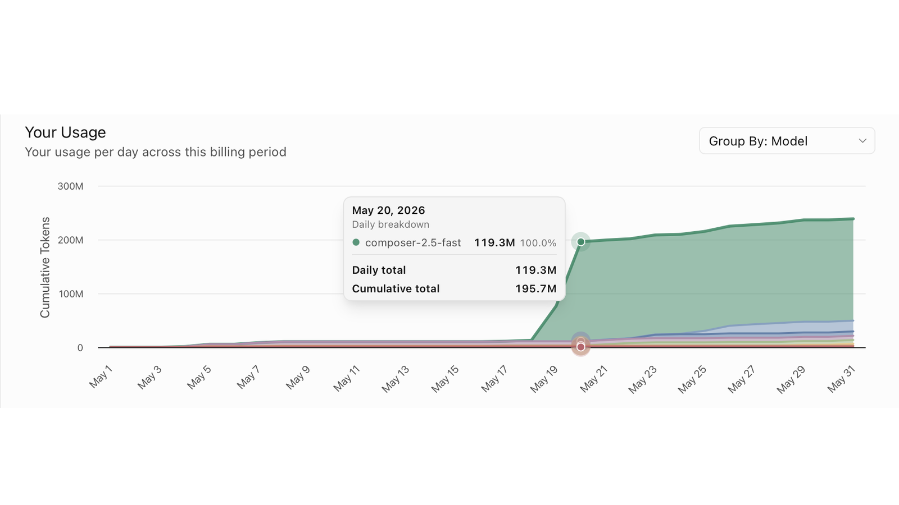

# Figma Clone Built With an AI Agent

[](https://nirajrajgor.com/blog/figma-clone-ai-agent)

> [!IMPORTANT]
> This repository is companion source for
> [I Spent 120M Tokens Building a Figma Clone With an AI Agent](https://nirajrajgor.com/blog/figma-clone-ai-agent).
> It is a historical reference snapshot: it is not maintained or supported,
> and it is not intended for production or public deployment. The application
> has no authentication and may contain known security and dependency issues.

Screen layout for teams—device frames, shapes, text, and optional **image layers**, with **export** to PNG.

## Docs

- [CONTEXT.md](./CONTEXT.md) — domain glossary
- [PRD v1](./docs/PRD-v1-image-annotation.md)
- [PRD v4 — screen design pivot](./docs/PRD-v4-screen-design-pivot.md)
- [Issues v1](./docs/issues/README.md) — 001–013 (done)
- [Issues v4 phase 1](./docs/issues/README-v4.md) — 030–037 (parallel-ready)
- [ADRs](./docs/adr/)

## Stack

**Next.js** + **SQLite** ([ADR 0002](./docs/adr/0002-nextjs-full-stack.md))

## Develop

```bash
npm install
npm run dev          # http://127.0.0.1:3000
npm run test         # Vitest (markup document + export compositor)
npm run e2e          # Playwright, headful — watch tests run
npm run e2e:headless # CI / no display only
```

E2E conventions: [docs/issues/E2E.md](./docs/issues/E2E.md)

## Status

v1 vertical slices **#001–#013** implemented; v4 phase 1 (**#030–#037**) adds screen-design UX and blank design files. Run `npm run dev`, then `npm run e2e` (headful) to watch E2E tests.

## Usage and rights

Copyright © 2026 Niraj Rajgor. All rights reserved.

Unless a license is added later, no open-source license is granted. The source
is provided for reading and educational reference only.
